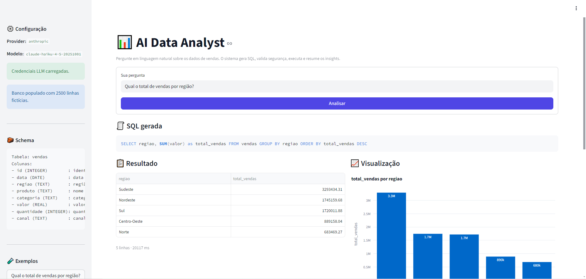
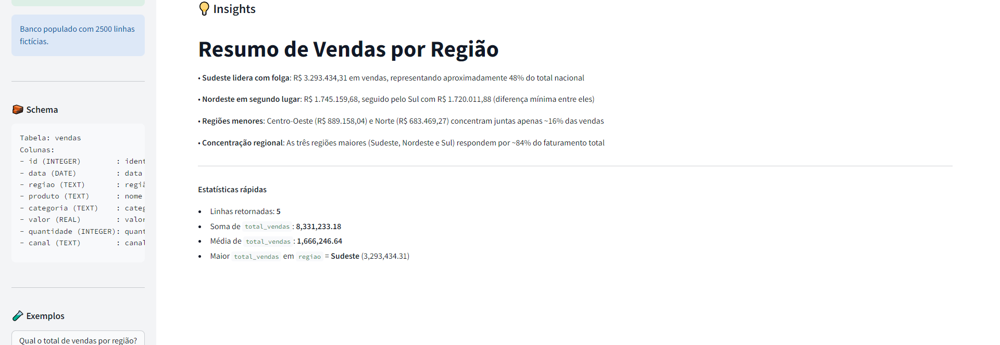

# 📊 AI Data Analyst

> **🌐 Demo ao vivo:** [ai-data-analyst-3rda.onrender.com](https://ai-data-analyst-3rda.onrender.com)
> *(Hospedado no plano free do Render — a primeira visita após inatividade leva ~30s para acordar.)*


Aplicação web que transforma **perguntas em linguagem natural** em consultas SQL executadas sobre um banco local de vendas, apresentando **tabela**, **gráfico automático** e **insights** gerados por LLM.

Projeto desenhado como peça de portfólio para vagas de **IA aplicada, Data Engineering e AI Engineering**, com foco em:

- Geração de SQL via LLM (Claude / GPT, configurável)
- **Defesa em profundidade:** 3 camadas de validação antes de qualquer execução
- Explicabilidade (SQL sempre visível ao usuário)
- Tratamento de erros transientes com retry + backoff
- Arquitetura modular e pronta para troca de backend (SQLite → PostgreSQL)

## 🖼️ Preview

**Da pergunta ao gráfico**, em uma tela: SQL gerada fica sempre visível para revisão antes da execução.



**Insights narrativos** gerados pelo LLM a partir do resultado, com estatísticas de apoio calculadas localmente:



## 🎯 Como testar em 30 segundos

1. Abra o [demo ao vivo](https://ai-data-analyst-3rda.onrender.com)
2. Clique em um dos exemplos na barra lateral (ex.: *"Qual o total de vendas por região?"*)
3. Veja: SQL gerada → tabela → gráfico → insights
4. Teste a segurança: pergunte *"Apague todas as vendas"* → bloqueado pela camada de intenção 🛡️

---

## 🧠 Como funciona

```
Pergunta do usuário
        │
        ▼
┌──────────────────┐
│      LLM         │  gera SQL (OpenAI / Anthropic / fallback heurístico)
└──────────────────┘
        │
        ▼
┌──────────────────┐
│  SQL Validator   │  bloqueia DELETE/DROP/UPDATE/… e múltiplas queries
└──────────────────┘
        │                         erro
        ▼                          │
┌──────────────────┐                ▼
│ Query Executor   │──────►  1 retry automático via LLM
└──────────────────┘
        │
        ▼
┌──────────────────┐
│ Tabela · Gráfico · Insights · Log CSV │
└──────────────────┘
```

---

## 🗂️ Estrutura do projeto

```
ai-data-analyst/
├── app.py                  # Interface Streamlit (UI)
├── requirements.txt
├── .env.example
├── README.md
├── src/
│   ├── config.py           # Env vars, schema e settings
│   ├── database.py         # Conexão SQLite
│   ├── sample_data.py      # Geração de dados sintéticos
│   ├── sql_validator.py    # Regras de segurança (core!)
│   ├── query_executor.py   # Execução + DataFrame
│   ├── llm.py              # Clientes OpenAI/Anthropic/heurístico
│   ├── charts.py           # Gráficos automáticos (Plotly)
│   ├── insights.py         # Insights via LLM + fallback estatístico
│   └── logger.py           # Log CSV de interações
├── data/                   # database.db (gerado em runtime)
├── logs/                   # query_logs.csv (gerado em runtime)
└── tests/
    ├── test_sql_validator.py
    └── test_query_executor.py
```

---

## 🚀 Instalação

**Requisitos:** Python 3.10+

```bash
# 1. Clonar o repositório
git clone <seu-repo>.git
cd ai-data-analyst

# 2. Criar e ativar ambiente virtual
python -m venv .venv
# Windows
.venv\Scripts\activate
# Linux/Mac
source .venv/bin/activate

# 3. Instalar dependências
pip install -r requirements.txt

# 4. Configurar variáveis de ambiente
cp .env.example .env
# edite .env e coloque sua OPENAI_API_KEY ou ANTHROPIC_API_KEY
```

### Variáveis de ambiente

| Variável            | Descrição                                              | Default             |
| ------------------- | ------------------------------------------------------ | ------------------- |
| `LLM_PROVIDER`      | `openai` ou `anthropic`                                | `openai`            |
| `LLM_MODEL`         | Modelo do provider                                     | `gpt-4o-mini`       |
| `OPENAI_API_KEY`    | Chave da OpenAI                                        | —                   |
| `ANTHROPIC_API_KEY` | Chave da Anthropic                                     | —                   |
| `DATABASE_PATH`     | Caminho do SQLite                                      | `data/database.db`  |
| `LOG_LEVEL`         | Nível de log                                           | `INFO`              |

> Sem chave de API, o app roda em **modo heurístico offline** — gera SQL a partir de padrões frequentes. Útil para demonstrações rápidas.

---

## ▶️ Executando

```bash
streamlit run app.py
```

Abra [http://localhost:8501](http://localhost:8501).

Na primeira execução:

1. O banco `data/database.db` é criado automaticamente.
2. A tabela `vendas` é populada com ~2.500 linhas fictícias realistas.
3. A interface mostra exemplos de perguntas na barra lateral.

---

## ☁️ Deploy no Render

O projeto inclui um [`render.yaml`](render.yaml) pronto para deploy one-click.

### Passos

1. Acesse [render.com](https://render.com) e faça login com GitHub
2. Clique em **New → Blueprint**
3. Conecte seu repositório `ai-data-analyst`
4. Render detecta o `render.yaml` e cria o serviço automaticamente
5. Em **Environment**, cole sua chave:
   - `ANTHROPIC_API_KEY` = `sk-ant-...`
6. Clique em **Apply** — o build leva ~3 minutos

### URL pública

Após o deploy, seu app fica em `https://ai-data-analyst-xxxx.onrender.com`.

> ⚠️ **Plano free hiberna após 15 min de inatividade.** A primeira request depois da hibernação demora ~30 segundos (cold start). Para portfólio e demos é aceitável.

### Como o `render.yaml` funciona

```yaml
startCommand: streamlit run app.py --server.port $PORT --server.address 0.0.0.0 ...
```

Render injeta a porta via `$PORT`. O bind em `0.0.0.0` permite tráfego externo (ao contrário do `localhost` local). Secrets marcados com `sync: false` (como a API key) precisam ser preenchidos manualmente no dashboard — nunca ficam no YAML.

---

## 💬 Exemplos de perguntas

- *Qual o total de vendas por região?*
- *Quais os 5 produtos mais vendidos em valor?*
- *Como foi a evolução mensal das vendas no último ano?*
- *Qual canal de vendas teve melhor desempenho?*
- *Qual a categoria com maior ticket médio?*

---

## 🗃️ Schema da tabela `vendas`

| Coluna       | Tipo     | Descrição                                       |
| ------------ | -------- | ----------------------------------------------- |
| `id`         | INTEGER  | Identificador único                             |
| `data`       | DATE     | Data da venda (YYYY-MM-DD)                      |
| `regiao`     | TEXT     | Norte, Nordeste, Centro-Oeste, Sudeste, Sul     |
| `produto`    | TEXT     | Nome do produto                                 |
| `categoria`  | TEXT     | Eletrônicos, Vestuário, Alimentos, Casa, Livros |
| `valor`      | REAL     | Valor total da venda em R\$                    |
| `quantidade` | INTEGER  | Quantidade vendida                              |
| `canal`      | TEXT     | Online, Loja Física, Marketplace                |

Os dados são **sintéticos** e gerados com sazonalidade (picos em novembro/dezembro) e pesos realistas por região.

---

## 🔒 Regras de segurança de SQL

O módulo [`src/sql_validator.py`](src/sql_validator.py) bloqueia qualquer query que:

- Não seja `SELECT` (ou `WITH ... SELECT`)
- Contenha qualquer destas palavras-chave:
  `DELETE, DROP, UPDATE, INSERT, ALTER, TRUNCATE, CREATE, REPLACE, ATTACH, DETACH, PRAGMA, VACUUM, GRANT, REVOKE, MERGE, EXEC, EXECUTE`
- Contenha `;` no meio (múltiplas queries)
- Referencie qualquer tabela diferente de `vendas`

A validação acontece **antes** de qualquer chamada ao banco. Se falhar, o sistema pede ao LLM uma nova tentativa passando o erro como contexto (retry único).

---

## 🧪 Testes

```bash
pytest -q
```

Cobrem:

- Todas as palavras proibidas rejeitadas
- SELECTs válidos aceitos (incluindo CTE `WITH`)
- Rejeição de múltiplas queries
- Rejeição de tabelas não permitidas
- Execução real ponta-a-ponta contra SQLite isolado

---

## 🔧 Extensibilidade

**Trocar SQLite por PostgreSQL:** substitua `src/database.py` por uma conexão `psycopg` e ajuste o DSN no `.env`. O restante do código permanece o mesmo, pois usa `pandas.read_sql_query`.

**Trocar de LLM provider:** basta mudar `LLM_PROVIDER` no `.env`. Há classes `OpenAIClient` e `AnthropicClient` em [`src/llm.py`](src/llm.py). Para adicionar outro provider, implemente o Protocol `LLMClient`.

**Adicionar novas tabelas:** atualize `TABLE_SCHEMA` e `SCHEMA_DESCRIPTION` em [`src/config.py`](src/config.py) e ajuste a whitelist no validator.

---

## 📜 Logging

Todas as interações são salvas em `logs/query_logs.csv` com: `timestamp, question, sql, status, rows, error, duration_ms`.

Útil para debug, análise de uso e treinamento futuro de um modelo próprio de NL→SQL.

---

## 🎯 Decisões de projeto

- **Streamlit** em vez de React/FastAPI: para um MVP de portfólio, reduz drasticamente a fricção de demonstração.
- **SQLite** como padrão: zero dependência externa, reprodutível em qualquer máquina.
- **Validação regex + sqlparse**: camada dupla para minimizar chance de injeção ou bypass.
- **Cache em sessão**: evita chamadas repetidas ao LLM para a mesma pergunta dentro da sessão.
- **Fallback heurístico**: a UX não quebra se faltar chave — permite rodar o projeto sem custo.

---

## 📄 Licença

MIT.
