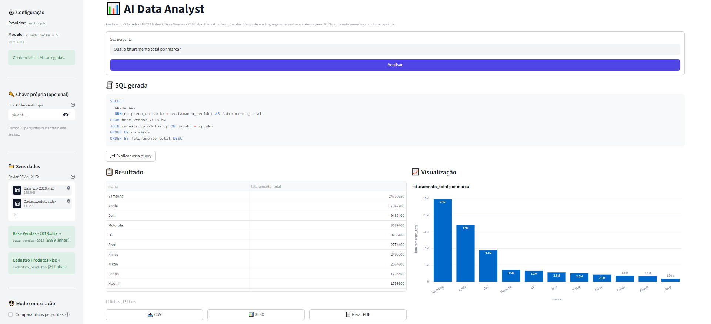
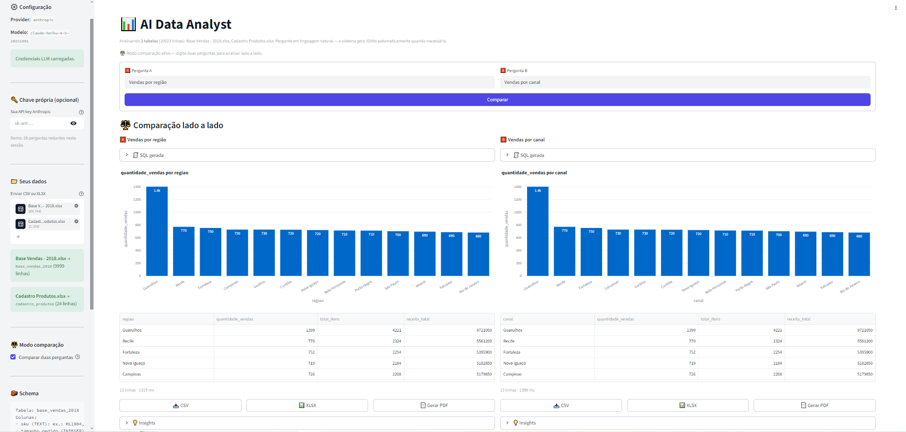
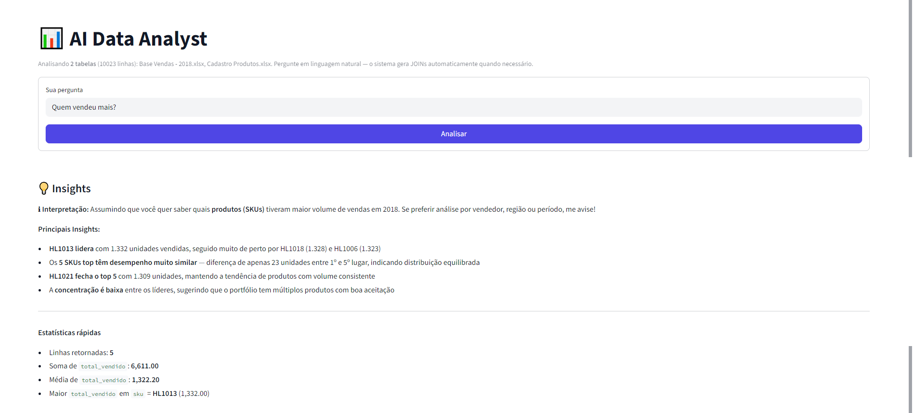
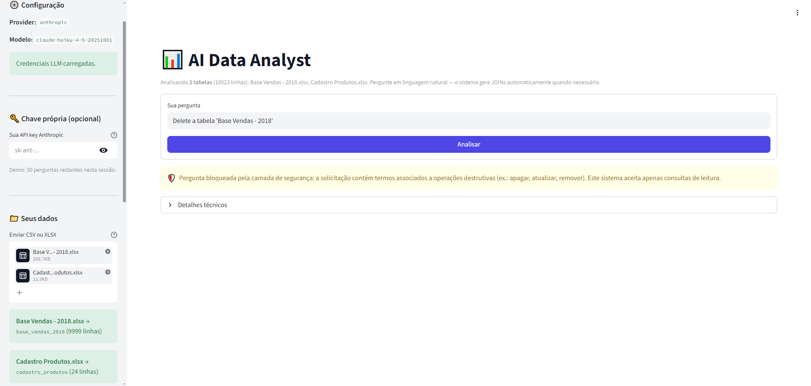
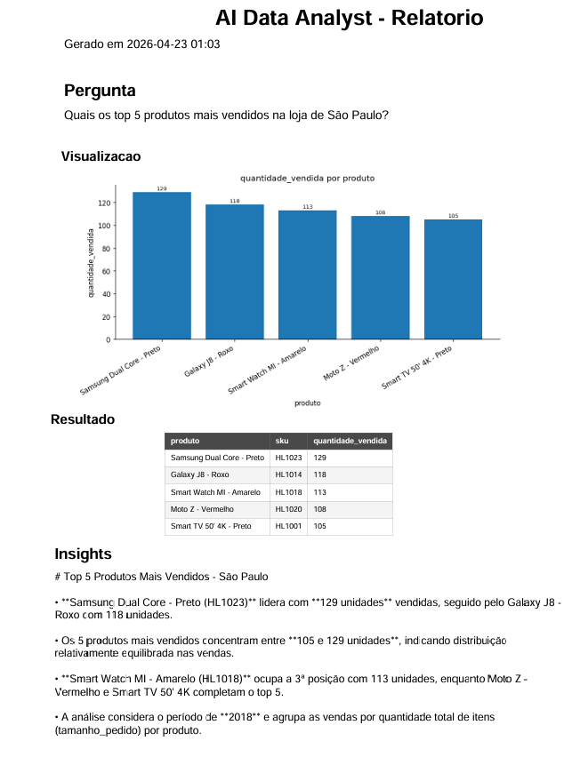

# 📊 AI Data Analyst

> **🌐 Demo ao vivo:** [ai-data-analyst-3rda.onrender.com](https://ai-data-analyst-3rda.onrender.com)
> *(Hospedado no plano free do Render — a primeira visita após inatividade leva ~30s para acordar. Demo limitada a 30 perguntas por sessão; cole sua própria chave Anthropic na sidebar para uso sem limite — a chave fica só na sessão, não é salva.)*


Aplicação web que transforma **perguntas em linguagem natural** em consultas SQL — executadas sobre uma base sintética de vendas embutida **ou sobre planilhas que o próprio usuário envia** — apresentando tabela, gráfico automático e insights gerados por LLM.

Projeto desenhado como peça de portfólio para vagas de **IA aplicada, Data Engineering e AI Engineering**.

## ✨ Features

- 🤖 **NL → SQL via LLM** (Claude / GPT, configurável)
- 📁 **Upload de CSV/XLSX com JOIN automático** — múltiplas planilhas viram tabelas e a LLM infere os relacionamentos
- ⚖️ **Modo comparação** — duas perguntas analisadas lado a lado
- 📄 **Exportação em PDF, XLSX e CSV** — relatório completo pronto para enviar
- 🛡️ **Defesa em profundidade** — 3 camadas de validação (intenção → SQL → execução read-only)
- 💬 **Explicabilidade** — SQL sempre visível + botão "Explicar essa query"
- 🕘 **Histórico clicável** com cache de sessão (re-execução instantânea)
- ⚡ **Retry + backoff** automático para falhas transientes da API
- 🧠 **Sinalização de ambiguidade** — quando a pergunta é vaga, a LLM declara qual interpretação assumiu
- 🔌 **Modo offline** — fallback heurístico funciona sem API key

## 🖼️ Preview

**Da pergunta ao gráfico**, em uma tela: SQL gerada fica sempre visível para revisão antes da execução.


**Insights narrativos** gerados pelo LLM a partir do resultado, com estatísticas de apoio calculadas localmente:


**Upload multi-arquivo com JOIN automático**: arraste duas planilhas (vendas + cadastro de produtos) e pergunte como se fosse uma só tabela. A LLM infere a chave de junção pelos nomes e valores das colunas.



**Modo comparação**: duas perguntas, dois gráficos, dois conjuntos de insights — tudo na mesma tela.



**Sinalização de ambiguidade**: quando a pergunta é vaga (*"quem vendeu mais?"*), a resposta começa declarando a interpretação assumida e sugere alternativas.



**Camada de segurança em ação**: pedidos com intenção destrutiva são bloqueados *antes* de chegar ao LLM.



**Relatório PDF**: SQL + visualização + tabela + insights, formatado para envio direto a um cliente ou stakeholder.



## 🎯 Como testar em 30 segundos

1. Abra o [demo ao vivo](https://ai-data-analyst-3rda.onrender.com)
2. Clique em um dos exemplos na barra lateral (ex.: *"Qual o total de vendas por região?"*)
3. Veja: SQL gerada → tabela → gráfico → insights
4. **Suba seus próprios arquivos** em "📁 Seus dados" — pode ser 1 ou vários (vão virar tabelas que se cruzam via JOIN)
5. Ative ⚖️ **Modo comparação** para analisar duas perguntas lado a lado
6. Teste a segurança: pergunte *"Apague todas as vendas"* → bloqueado pela camada de intenção 🛡️

---

## 🧠 Como funciona

```
Pergunta do usuário
        │
        ▼
┌────────────────────────┐
│ 1. Intent Detector     │  bloqueia perguntas com termos destrutivos
└────────────────────────┘  (apague, delete, atualize…)
        │
        ▼
┌────────────────────────┐
│ 2. LLM Generator       │  gera SQL (Claude / GPT / heurístico offline)
└────────────────────────┘
        │
        ▼
┌────────────────────────┐
│ 3. SQL Validator       │  bloqueia DELETE/DROP/UPDATE/… e queries
└────────────────────────┘  fora da whitelist de tabelas
        │                              ┌─── falha ────┐
        ▼                              │              ▼
┌────────────────────────┐         retry com erro como contexto
│ 4. Executor (read-only)│         (até 1x via LLM)
└────────────────────────┘
        │
        ▼
┌────────────────────────────────────────────────────┐
│ Tabela · Gráfico · Insights · CSV · XLSX · PDF · Log │
└────────────────────────────────────────────────────┘
```

---

## 📁 Upload de seus próprios dados

Arraste um ou mais arquivos `.csv`, `.xlsx` ou `.xls` para a sidebar. O sistema:

1. **Cria uma tabela SQLite por arquivo** — nome derivado do nome do arquivo (sanitizado)
2. **Normaliza nomes de colunas** — `Preço Unitário` → `preco_unitario` (sem acentos, sem espaços)
3. **Detecta tipos automaticamente** — INTEGER, REAL, DATE, TEXT
4. **Inclui exemplos de valores** no schema enviado ao LLM (3-5 valores por coluna)
5. **Permite JOINs sem configuração** — a LLM infere a chave de junção pelos nomes e valores

> **Limite prático:** ~50 MB por arquivo no plano free do Render. Para datasets maiores, rode local (sem limite real).

**Exemplo de uso multi-tabela:**
- Suba `vendas.xlsx` (com SKU, quantidade, loja)
- Suba `produtos.xlsx` (com SKU, nome, marca, preço)
- Pergunte: *"Qual o faturamento total por marca?"*
- A LLM gera automaticamente: `SELECT marca, SUM(quantidade * preco) FROM vendas v JOIN produtos p ON v.sku = p.sku GROUP BY marca`

---

## ⚖️ Modo comparação

Ative o checkbox **"Comparar duas perguntas"** na sidebar. O formulário muda para aceitar 🅰️ Pergunta A e 🅱️ Pergunta B, e os resultados aparecem lado a lado — cada um com seu SQL, gráfico, tabela e insights.

Útil para contrastar dimensões (vendas por região × por canal) ou recortes (último trimestre × ano completo).

---

## 📄 Exportação de relatórios

Cada resultado pode ser exportado em três formatos:

- **📥 CSV** — separador padrão internacional (`,`), ideal para reimportação em pandas/SQL/Power BI
- **📊 XLSX** — abre direto no Excel com tipos preservados (números, datas, tabela formatada)
- **📄 PDF** — relatório completo gerado com [ReportLab](https://www.reportlab.com/): SQL + gráfico em alta resolução + tabela (até 50 linhas) + insights narrativos

---

## 🗂️ Estrutura do projeto

```
ai-data-analyst/
├── app.py                  # Interface Streamlit + orquestração + exports
├── requirements.txt
├── render.yaml             # Blueprint para deploy one-click no Render
├── .env.example
├── README.md
├── src/
│   ├── config.py           # Env vars, schema sintético e settings
│   ├── database.py         # Conexão SQLite + load_dataframe (multi-tabela)
│   ├── sample_data.py      # Geração de dados sintéticos
│   ├── sql_validator.py    # Defesa em profundidade (intent + SQL whitelist)
│   ├── query_executor.py   # Execução read-only + DataFrame
│   ├── llm.py              # Clientes OpenAI / Anthropic / heurístico
│   ├── charts.py           # Gráficos automáticos (Plotly)
│   ├── insights.py         # Insights via LLM + fallback estatístico
│   └── logger.py           # Log CSV de interações
├── data/                   # database.db (gerado em runtime)
├── logs/                   # query_logs.csv (gerado em runtime)
├── docs/                   # screenshots para o README
└── tests/
    ├── test_sql_validator.py
    └── test_query_executor.py
```

---

## 🚀 Instalação

**Requisitos:** Python 3.10+

```bash
# 1. Clonar o repositório
git clone <seu-repo>.git
cd ai-data-analyst

# 2. Criar e ativar ambiente virtual
python -m venv .venv
# Windows
.venv\Scripts\activate
# Linux/Mac
source .venv/bin/activate

# 3. Instalar dependências
pip install -r requirements.txt

# 4. Configurar variáveis de ambiente
cp .env.example .env
# edite .env e coloque sua OPENAI_API_KEY ou ANTHROPIC_API_KEY
```

### Variáveis de ambiente

| Variável            | Descrição                                              | Default             |
| ------------------- | ------------------------------------------------------ | ------------------- |
| `LLM_PROVIDER`      | `openai` ou `anthropic`                                | `openai`            |
| `LLM_MODEL`         | Modelo do provider                                     | `gpt-4o-mini`       |
| `OPENAI_API_KEY`    | Chave da OpenAI                                        | —                   |
| `ANTHROPIC_API_KEY` | Chave da Anthropic                                     | —                   |
| `DATABASE_PATH`     | Caminho do SQLite                                      | `data/database.db`  |
| `LOG_LEVEL`         | Nível de log                                           | `INFO`              |

> Sem chave de API, o app roda em **modo heurístico offline** — gera SQL a partir de padrões frequentes. Útil para demonstrações rápidas.

---

## ▶️ Executando

```bash
streamlit run app.py
```

Abra [http://localhost:8501](http://localhost:8501).

Na primeira execução:

1. O banco `data/database.db` é criado automaticamente.
2. A tabela `vendas` é populada com ~2.500 linhas fictícias realistas.
3. A interface mostra exemplos de perguntas na barra lateral.

---

## ☁️ Deploy no Render

O projeto inclui um [`render.yaml`](render.yaml) pronto para deploy one-click.

### Passos

1. Acesse [render.com](https://render.com) e faça login com GitHub
2. Clique em **New → Blueprint**
3. Conecte seu repositório `ai-data-analyst`
4. Render detecta o `render.yaml` e cria o serviço automaticamente
5. Em **Environment**, cole sua chave:
   - `ANTHROPIC_API_KEY` = `sk-ant-...`
6. Clique em **Apply** — o build leva ~3 minutos

### URL pública

Após o deploy, seu app fica em `https://ai-data-analyst-xxxx.onrender.com`.

> ⚠️ **Plano free hiberna após 15 min de inatividade.** A primeira request depois da hibernação demora ~30 segundos (cold start). Para portfólio e demos é aceitável.

### Como o `render.yaml` funciona

```yaml
startCommand: streamlit run app.py --server.port $PORT --server.address 0.0.0.0 ...
```

Render injeta a porta via `$PORT`. O bind em `0.0.0.0` permite tráfego externo (ao contrário do `localhost` local). Secrets marcados com `sync: false` (como a API key) precisam ser preenchidos manualmente no dashboard — nunca ficam no YAML.

---

## 💬 Exemplos de perguntas

**Sobre a base sintética (`vendas`):**
- *Qual o total de vendas por região?*
- *Quais os 5 produtos mais vendidos em valor?*
- *Como foi a evolução mensal das vendas no último ano?*
- *Qual canal de vendas teve melhor desempenho?*
- *Qual a categoria com maior ticket médio?*

**Multi-tabela (após upload de planilhas relacionadas):**
- *Qual o faturamento total por marca?* → JOIN automático
- *Qual a margem de lucro por categoria?* → calcula `preco - custo`
- *Top 5 produtos por loja* → agrupa cruzando dimensões
- *Compare o faturamento de Samsung vs Apple* → filtro + agregação

**Perguntas vagas (vão pedir interpretação):**
- *Quem vendeu mais?* → a LLM escolhe uma dimensão e declara a escolha

**Bloqueadas pela camada de segurança:**
- *Apague todas as vendas* 🛡️
- *Crie uma nova tabela de clientes* 🛡️

---

## 🗃️ Schema da base sintética `vendas`

| Coluna       | Tipo     | Descrição                                       |
| ------------ | -------- | ----------------------------------------------- |
| `id`         | INTEGER  | Identificador único                             |
| `data`       | DATE     | Data da venda (YYYY-MM-DD)                      |
| `regiao`     | TEXT     | Norte, Nordeste, Centro-Oeste, Sudeste, Sul     |
| `produto`    | TEXT     | Nome do produto                                 |
| `categoria`  | TEXT     | Eletrônicos, Vestuário, Alimentos, Casa, Livros |
| `valor`      | REAL     | Valor total da venda em R\$                    |
| `quantidade` | INTEGER  | Quantidade vendida                              |
| `canal`      | TEXT     | Online, Loja Física, Marketplace                |

Os dados são **sintéticos** e gerados com sazonalidade (picos em novembro/dezembro) e pesos realistas por região.

> Quando o usuário sobe seus próprios arquivos, esse schema é substituído dinamicamente pelo schema das planilhas enviadas.

---

## 🔒 Regras de segurança

A defesa é em **três camadas independentes**:

### Camada 1 — Detecção de intenção (na pergunta)
Antes de chamar o LLM, a pergunta é varrida por padrões em português que indicam intenção destrutiva: *apagar, delete, atualizar, remover, dropar, criar tabela…*
Se houver match, a pergunta é bloqueada com aviso amigável — o LLM nem é chamado.

### Camada 2 — Validação sintática do SQL
O módulo [`src/sql_validator.py`](src/sql_validator.py) bloqueia qualquer query que:

- Não seja `SELECT` (ou `WITH ... SELECT`)
- Contenha qualquer destas palavras-chave:
  `DELETE, DROP, UPDATE, INSERT, ALTER, TRUNCATE, CREATE, REPLACE, ATTACH, DETACH, PRAGMA, VACUUM, GRANT, REVOKE, MERGE, EXEC, EXECUTE`
- Contenha `;` no meio (múltiplas queries)
- Referencie qualquer tabela fora da whitelist dinâmica (default `vendas`, ampliada com tabelas do upload)

Se o SQL for inválido, o sistema pede ao LLM uma nova tentativa passando o erro como contexto (retry único).

### Camada 3 — Execução read-only
A conexão SQLite é aberta em modo `read_only`, então mesmo que algo escapasse das duas camadas anteriores, o banco recusaria modificações.

---

## 🧪 Testes

```bash
pytest -q
```

Cobrem:

- Todas as palavras proibidas rejeitadas
- SELECTs válidos aceitos (incluindo CTE `WITH`)
- Rejeição de múltiplas queries
- Rejeição de tabelas não permitidas
- Execução real ponta-a-ponta contra SQLite isolado

---

## 🔧 Extensibilidade

**Trocar SQLite por PostgreSQL:** substitua `src/database.py` por uma conexão `psycopg` e ajuste o DSN no `.env`. O restante do código permanece o mesmo, pois usa `pandas.read_sql_query`.

**Trocar de LLM provider:** basta mudar `LLM_PROVIDER` no `.env`. Há classes `OpenAIClient` e `AnthropicClient` em [`src/llm.py`](src/llm.py). Para adicionar outro provider, implemente o Protocol `LLMClient`.

**Adicionar novas tabelas fixas:** atualize `TABLE_SCHEMA` e `SCHEMA_DESCRIPTION` em [`src/config.py`](src/config.py) e ajuste a whitelist no validator. (Para tabelas dinâmicas vindas de upload, o sistema já faz tudo automaticamente.)

---

## 📜 Logging

Todas as interações são salvas em `logs/query_logs.csv` com: `timestamp, question, sql, status, rows, error, duration_ms`.

Útil para debug, análise de uso e treinamento futuro de um modelo próprio de NL→SQL.

---

## 🎯 Decisões de projeto

- **Streamlit** em vez de React/FastAPI: para um MVP de portfólio, reduz drasticamente a fricção de demonstração.
- **SQLite** como padrão: zero dependência externa, reprodutível em qualquer máquina.
- **Validação regex + sqlparse**: camada dupla para minimizar chance de injeção ou bypass.
- **Detecção de intenção em pt-BR**: bloqueia ataques antes mesmo do LLM ser chamado, economizando tokens e reduzindo superfície de ataque.
- **Upload sem configurar relacionamento**: confiamos na capacidade do LLM de inferir JOIN keys a partir de nomes e valores de exemplo das colunas — em vez de exigir que o usuário desenhe um modelo, como faz o Power BI.
- **Normalização automática de colunas**: planilhas humanas têm acentos e espaços (`"Preço Unitário"`); normalizamos para `preco_unitario` para evitar erros de SQL e simplificar prompts.
- **Sinalização de ambiguidade**: para perguntas vagas, o LLM declara qual interpretação assumiu — torna a IA auditável em vez de uma caixa preta.
- **Cache em sessão**: evita chamadas repetidas ao LLM para a mesma pergunta dentro da sessão.
- **Fallback heurístico**: a UX não quebra se faltar chave — permite rodar o projeto sem custo.

---

## 📄 Licença

MIT.
